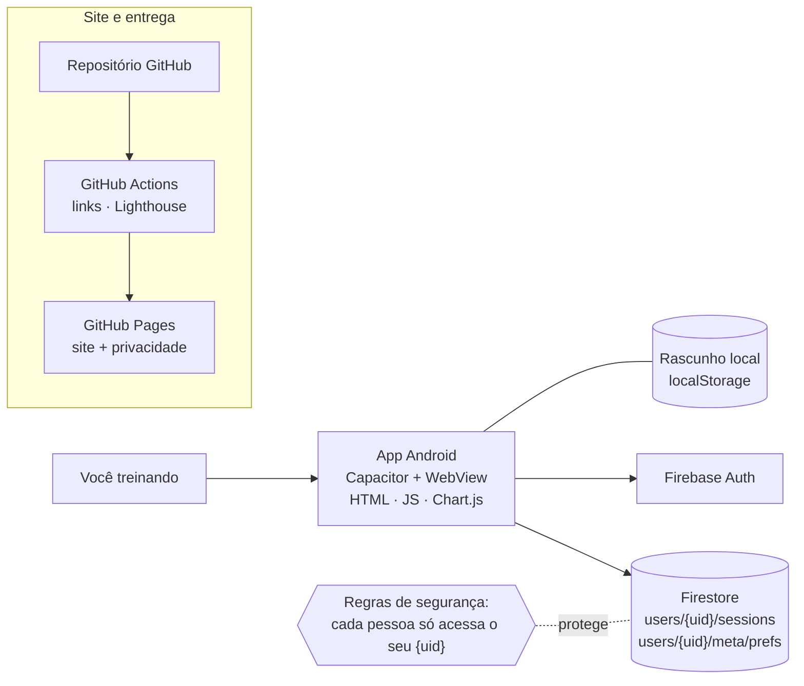

# Arquitetura do MaxProgress

```mermaid
flowchart LR
  U[Você treinando] --> APP["App Android<br/>Capacitor + WebView<br/>HTML · JS · Chart.js"]
  APP --- DRAFT[("Rascunho local<br/>localStorage")]
  APP --> AUTH[Firebase Auth]
  APP --> DB[("Firestore<br/>users/{uid}/sessions<br/>users/{uid}/meta/prefs")]
  RULES{{"Regras de segurança:<br/>cada pessoa só acessa o seu {uid}"}} -.protege.- DB

  subgraph Site e entrega
    REPO[Repositório GitHub] --> CI["GitHub Actions<br/>links · Lighthouse"] --> PAGES[GitHub Pages<br/>site + privacidade]
  end
```

O código do app é privado; este repositório contém apenas o site.
